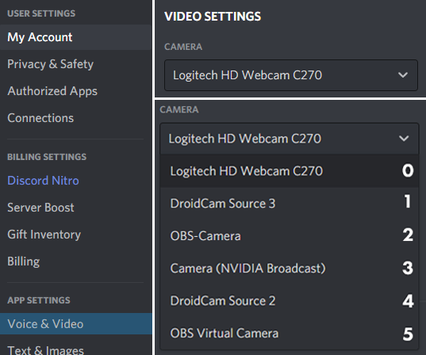

# How to find your camera's ID
*Note: Your camera's ID will usually be 0, so make sure to try that first!*

## Text instructions
- First, open Discord
- Navigate to your user settings, then go into Voice & Video
- Scroll down to the Video Settings section
- Click the camera dropdown
- The cameras in the list are sorted by ID, starting with 0

## Image instructions

### Press ESC to close these instructions